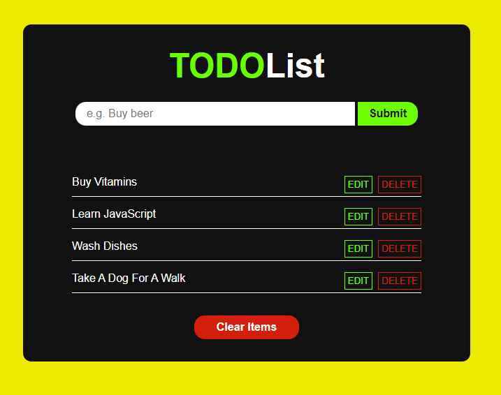

# Todo List

> A simple website where user can add, edit and delete items.

## General info

> The objective of the project is to practice separation of concern in
> JavaScript.

## Screenshots



## Technologies

- JavaScript
- HTML5
- CSS3
- VSC code

## Setup

Clone the repo and run npm install.

## Code Examples

```js
import dom from '../dom.js';
import addItemHandler from '../handlers/addItemHandler.js';

const addItemEvent = () => {
	dom.submitBtn.addEventListener('click', (e) => {
		addItemHandler(e);
	});
};

export default addItemEvent;
```

## Status

Project is: _done_

## Contact

[Agnieszka Dzwolak](https://github.com/Agnieszka-Dzwolak)
